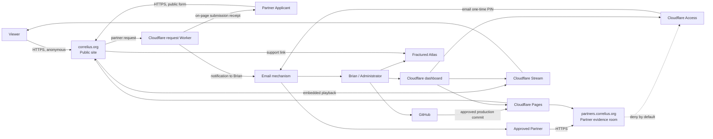

# Correlius.org MVP — System Context

## Purpose and scope

Correlius.org exists to exhibit released Correlius films publicly, explain the project's mental-health and cultural purpose, route contributions through Fractured Atlas, and provide approved professional partners with a private evidence room. The MVP is a nonprofit, noncommercial Star Wars fan-film website run primarily by Brian Payne. It must make the films easy to watch while remaining safe and maintainable for one technical owner.

This design covers two deliberately separate web surfaces:

- `correlius.org`: public, anonymous, indexable, film-centered.
- `partners.correlius.org`: deny-by-default, authenticated, non-indexable, professional evidence room.

It does not implement either site. Product claims, copy, episode data, research findings, and legal statements remain governed by the Correlius MVP requirements and approved source materials.

## Business and project context

Correlius explores Black characters, mental health, family, healing, avoidance, trauma, self-worth, and unconventional strength through nonprofit fan filmmaking (US-01, US-02). The public surface establishes the project and offers released films without an account (US-03–US-07). The partner surface supports editorial consideration, discussions, screenings, collaboration, and informed contributions without exposing private evidence or personal identifiers (US-08–US-15, US-18).

The website supports filmmaking; it is not a community platform, commerce product, research database, or general-purpose publishing system. Static content and provider-managed controls are preferred over custom services.

## Users and personas

| Persona | Goal | Authentication | Information access |
|---|---|---:|---|
| Public viewer | Understand the project and watch released films | None | Public pages and public Stream assets |
| Prospective supporter | Assess the project and donate | None | Public project/support information; Fractured Atlas handles contribution |
| Partner applicant | Request consideration for partner access | None | Public For Partners page and request form only |
| Approved partner | Evaluate evidence, feature materials, collaboration options, or donor brief | Email OTP through Cloudflare Access | All approved partner pages/resources |
| Brian / administrator | Publish content, operate accounts, approve/revoke access, review metrics | GitHub/Cloudflare account authentication with 2FA | Source, deployment controls, Stream, Access policy/logs, analytics |
| Legal advisor | Advise Brian if an inquiry occurs | Outside the website | Private response plan and legal materials held outside the public repository |

The partner audience includes approved podcasters, forum/community moderators, convention organizers, journalists, clinicians, collaborators, and prospective donors (US-08). These are use-case descriptions, not separate authorization roles; multiple permission tiers are outside MVP.

## External systems

| System | MVP responsibility | Data exchanged |
|---|---|---|
| GitHub | Version control, pull requests, branch protection, dependency alerts, build trigger | Site source, static content, non-secret configuration |
| Cloudflare Pages | Builds and edge-serves two static sites | Generated HTML/CSS/JS and approved downloadable assets |
| Cloudflare Stream | Stores, transcodes, plays, and measures released video assets | Streaming asset, captions, poster/thumbnail configuration, playback analytics |
| Cloudflare Access | Enforces partner authentication and allowlist policy before origin retrieval | Approved email identities, OTP flow, session tokens, authentication logs |
| Cloudflare Worker services | Processes public partner requests and first-party custom analytics events | Validated form data, ephemeral duplicate marker, aggregate event records |
| Cloudflare Turnstile | Spam challenge for the public request form | Short-lived challenge token; server-side validation result |
| Cloudflare KV | Holds only a keyed, non-reversible duplicate marker with a 24-hour TTL | HMAC of normalized applicant email and expiration; no form body |
| Cloudflare Email Service | Sends the request notification to Brian's verified destination address | Submitted request details and delivery metadata; applicant confirmation is rendered on the site |
| Fractured Atlas | Hosts and processes donations | Visitor leaves Correlius; no payment data returns to Correlius |
| DNS/registrar | Domain routing, DNSSEC, renewal, transfer protection | Domain records and account controls |
| Applicant/partner email provider | Receives Cloudflare Access PINs | PIN email and provider delivery metadata |

## System boundary

Inside the Correlius web-system boundary are the public static site, protected partner static site, the narrow request-processing Worker, public/partner analytics configuration, and their deployment configuration. GitHub, Cloudflare managed services, Fractured Atlas, the registrar, email providers, source-master storage, and Brian's private operational records are externally managed dependencies.

The following are explicitly outside the deployed system:

- source-master video files;
- raw survey exports and participant identifiers;
- partner email allowlists (held in Cloudflare Access configuration);
- form-submission archives (the MVP does not create one);
- privileged legal analysis, insurance files, and the US-21 response plan;
- payment credentials or donation processing.

## System-context diagram

## Trust boundaries

1. **Public browser ↔ Cloudflare edge.** All inputs are untrusted. HTTPS, WAF, bot controls, CSP, output encoding, request-size limits, Turnstile, and rate limiting apply.
2. **Cloudflare Access ↔ partner origin.** Access must decide before any partner HTML or download is returned. `noindex` is defense in depth, never authorization.
3. **Public project ↔ partner project.** Separate Pages projects, build outputs, custom hostnames, and repositories prevent an accidental public build from containing partner assets.
4. **Build system ↔ production.** Only reviewed commits on the protected production branch may deploy; secrets are provider-side, least-privilege, and never bundled into client output.
5. **Website ↔ Cloudflare Stream.** Public playback uses a Stream UID plus allowed-origin restrictions. Masters never cross into GitHub or Pages.
6. **Form Worker ↔ email/KV.** The Worker accepts untrusted inputs, validates them, stores only a short-lived keyed digest, and transmits the minimum submission through email.
7. **Correlius ↔ Fractured Atlas.** Donation handling leaves the Correlius boundary. The support page must make the transition clear.
8. **Deployed systems ↔ private records.** Research source data, sensitive legal/insurance material, and the incident-response document stay in separately controlled private storage.

## Information classification

| Classification | Examples | Permitted locations |
|---|---|---|
| Public | Public copy, episode metadata, thumbnails, released captions, disclaimer | Public repository, public Pages project, Stream |
| Partner-confidential | Audience report PDF, approved stills/package, donor brief, partner contact details intended for download | Private partner repository/project behind Access only |
| Operational-sensitive | Applicant submissions, approved-email allowlist, Access logs, security contacts | Cloudflare configuration/logs and authorized email accounts; never client code |
| Restricted | Raw survey data, participant identifiers, privileged legal analysis, insurance records, source masters, credentials | Private storage outside deployed repositories/sites; secrets only in provider secret stores |

Anonymous quotations are partner-confidential only after de-identification and traceability checks against restricted source data (US-10, US-18).

## Major user journeys

1. **Discover and watch:** viewer arrives on a shareable public page, understands the project, opens Watch, selects a released episode, and uses an embedded, captioned Stream player (US-01–US-06, US-20, US-22).
2. **Support:** visitor reads funding context and follows a clearly external Fractured Atlas link; Correlius never handles payment data (US-07).
3. **Request partner access:** applicant submits minimum fields plus Turnstile; the Worker validates, detects a recent duplicate, emails Brian, and returns a durable on-page confirmation without granting access (US-08). The MVP does not email the applicant because arbitrary-recipient Cloudflare sending requires a paid Workers plan.
4. **Approve and authenticate:** Brian manually reviews the email, adds the exact email to Cloudflare Access, and tells the applicant. Access sends a short-lived PIN and issues an expiring session only when policy matches (US-09, US-15).
5. **Evaluate and contact:** authenticated partner reviews evidence and materials, downloads protected resources, and selects Contact Brian or the Fractured Atlas action (US-10–US-13).
6. **Publish an episode:** Brian uploads a master to Stream, configures captions/origins, adds static metadata, validates a preview, merges an approved change, and verifies production without altering navigation or authentication logic (US-14, US-16).
7. **Revoke access or content:** Brian removes an email and revokes its active Access session, or unpublishes an episode and disables the Stream asset according to documented runbooks (US-15, US-21).

## Architecture constraints

- GitHub source control and Cloudflare Pages/edge delivery.
- Cloudflare Stream, Access, one-time PIN, native security/analytics/alerting where adequate.
- No application database, custom CMS, ordinary viewer accounts, donation processing, or major extra platform.
- Public and partner build/deployment boundaries remain separate.
- Static-first, low-cost, reversible deployment; at least four episodes without redesign.
- WCAG 2.2 AA-oriented implementation and testing (the requirements say WCAG AA without naming a version; 2.2 is the implementation baseline decision).
- Free or near-free operation is a hard acceptance gate. No feature may silently require a Pro, Business, Enterprise, or usage tier outside the approved cost envelope.

## Cost guardrail

The target operating model is free-tier infrastructure plus only unavoidable near-free costs:

| Service | Cost posture | Guardrail |
|---|---|---|
| Cloudflare Pages, Workers/Functions, KV, Turnstile, Web Analytics, Analytics Engine | Free-tier target | Stay within documented free quotas; do not auto-upgrade |
| Cloudflare Access | Free for fewer than 50 active users | Cap the MVP at 50 active partner seats; revoke inactive users |
| Cloudflare Stream | Required usage-based near-free service | Prepaid storage is $5 per 1,000 stored minutes; delivery is $1 per 1,000 delivered minutes; no autoplay/preload and billing alerts |
| GitHub | Free public repository; private partner branch protection requires GitHub Pro (about $4/month) | Approve this near-free baseline or US-24 branch protection is a no-go |
| Domain registration | Existing unavoidable annual cost | Auto-renew and monitor |

Cloudflare Pro Health Checks, Workers Paid merely for applicant email, paid Zero Trust seats/log retention, Enterprise Logpush, paid bot management, third-party APM, and similar upgrades are excluded. If a free tier changes, the affected optional capability is disabled or the requirement is reopened before cost is incurred.

## Architectural assumptions

- Brian controls `correlius.org`, its registrar, Cloudflare account, GitHub account/organization, and a monitored domain mailbox.
- Two completed episodes and approved public/partner assets will be supplied before launch.
- Cloudflare plan features and costs will be verified during implementation; the design assumes Free tiers except Stream usage and explicitly approved near-free GitHub Pro.
- The partner evidence room uses one authorization tier.
- The partner evidence room stays below Cloudflare Access's 50-active-user Free-plan limit.
- A private storage location outside the public repository exists for source masters, raw research, and the US-21 plan.
- Cloudflare Email Service can send the notification to Brian's verified destination for free. Applicant confirmation is an accessible on-page receipt, not email.

## Architectural decisions

- **AD-01 — Two Pages projects and two GitHub repositories.** Keep the public site repository separable from a private partner repository. This is the simplest strong control against publishing partner files in a public build.
- **AD-02 — Static site generator.** Use Astro in static-output mode with content collections/schema validation and no client JavaScript unless a component needs it. This is an implementation choice, not an MVP requirement.
- **AD-03 — Minimal form state.** Use KV only for an HMAC(email) duplicate marker with a 24-hour TTL. It is ephemeral abuse-control state, not an application content database.
- **AD-04 — Eight-hour partner session.** An 8-hour Access policy session balances professional convenience and exposure; revocation remains available sooner.
- **AD-05 — WCAG baseline.** Test against WCAG 2.2 Level AA, while explicitly satisfying every US-06 acceptance criterion.
- **AD-06 — Hard cost ceiling.** Use free tiers by default. Permit only domain renewal, Stream's low-volume usage, and GitHub Pro for the private protected branch as near-free baseline costs. Anything else is a no-go pending a requirement change.

## Explicit non-goals

The architecture excludes public comments/forums, ordinary viewer accounts, paid memberships/subscriptions, merchandise, a lore encyclopedia, custom donation processing, donor dashboards, CRM automation, partner permission tiers, live streaming, native apps, screen-recording prevention, the full fair-use memo, raw survey hosting, searchable databases/custom CMS, third-party APM/error tracking, a formal bug bounty, and a paid penetration test. These exclusions are verified again in the traceability matrix.

## Open questions

1. Confirm whether Brian approves two repositories, with the partner repository private.
2. Confirm the monitored `security.txt`, partner-request, and Contact Brian addresses.
3. Confirm the private storage location and authorized decision-maker for the US-21 response plan.
4. Confirm an 8-hour partner session and whether the Free-plan 24-hour Access-log window is acceptable; paid 30-day retention is a no-go under the cost constraint.
5. Confirm that an accessible on-page receipt satisfies the applicant-confirmation criterion; no applicant email is sent.
6. Confirm that GitHub Pro at approximately $4/month is within “near free” for protected branches on the private partner repository.
7. Define a numeric monthly/annual cost ceiling and Stream alert threshold so “near free” is testable.
8. Confirm the production Fractured Atlas URL, episode metadata/assets, approved partner materials, and final legal/disclaimer wording.
