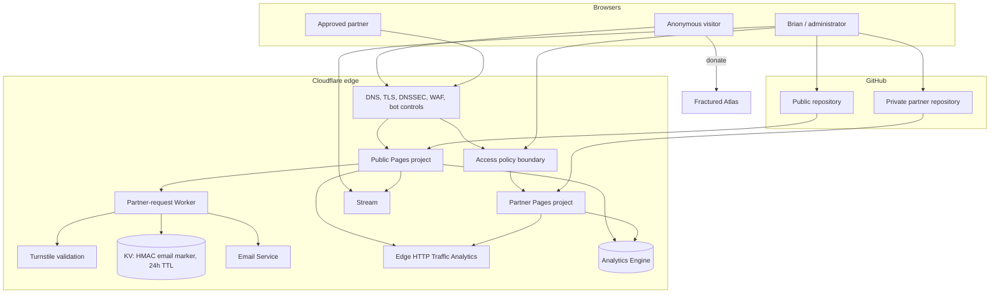
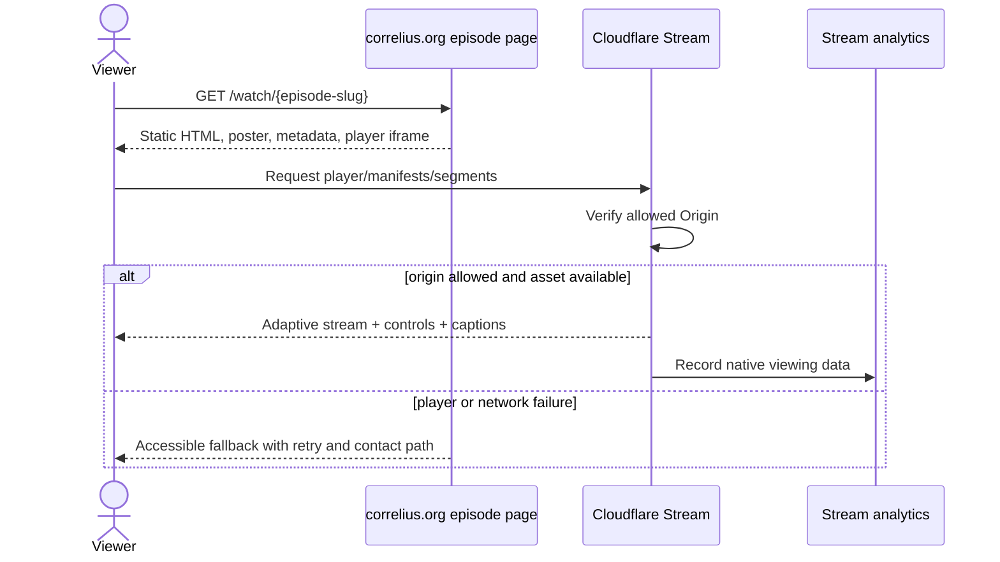
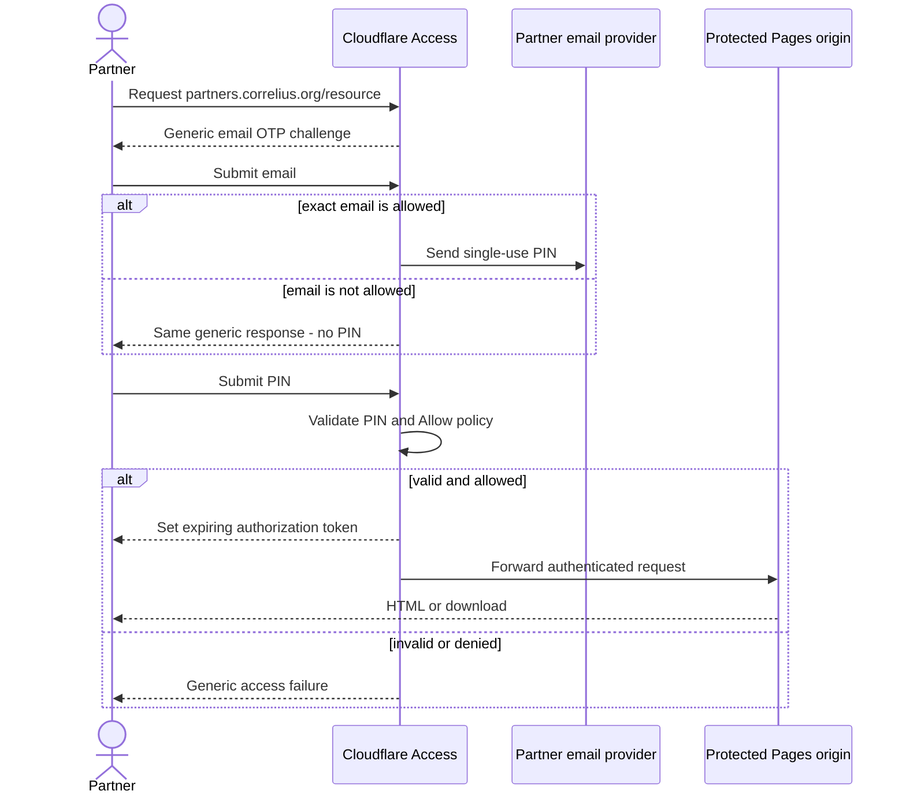
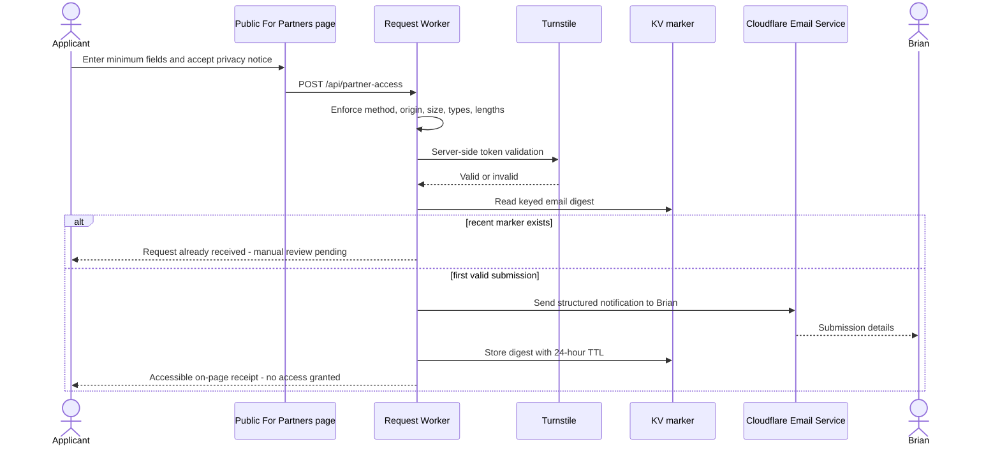

# Correlius.org MVP — Overall Technical Architecture

## Architecture style

The MVP is a **static-first, edge-hosted, two-surface architecture**. Two independent static sites are built from GitHub and deployed to separate Cloudflare Pages projects. Cloudflare Access forms the front-door authorization boundary for every partner hostname and deployment URL. A single narrow Worker handles the only public write operation (partner-access request), and an equally narrow first-party event endpoint records the few actions Cloudflare's native page/video analytics do not measure.

This is not a single-page application, server-rendered application, microservice estate, or database-backed CMS. Pages are generated at build time. Client JavaScript is limited to visitor-initiated Stream and Turnstile loading, navigation behavior where unavoidable, and narrowly enumerated first-party aggregate event calls.

## Component inventory and MVP justification

| Component | Responsibility | Why it exists in MVP |
|---|---|---|
| Public Astro static site | Public routes, episode catalog, content, metadata | US-01–US-07, US-17, US-20, US-22 |
| Partner Astro static site | Protected portal and downloads | US-09–US-13, US-15, US-18 |
| Public Pages project | Atomic public builds and edge delivery | US-16, US-22 |
| Partner Pages project | Separate protected origin/build output | US-09, US-15, US-18 |
| Cloudflare Access application(s) | Allowlisted email OTP, sessions, revocation, logs | US-09, US-15, US-24 |
| Cloudflare Stream | Video storage/transcoding/player/captions/analytics | US-04–US-06, US-14, US-19 |
| Partner-request Worker | Validates and delivers form submissions | US-08, US-18, US-25, US-28 |
| Turnstile | Form spam control | US-08, US-25 |
| KV duplicate marker | Flags normalized email for 24 hours | US-08; smallest state that meets duplicate detection |
| Email Service | Notification to Brian's verified destination | US-08, US-28 |
| Edge HTTP Traffic Analytics | Aggregate request/page-traffic measurement separated by hostname | US-19, US-22 |
| Analytics Engine event dataset | First-party starts/clicks/submissions/contact events | US-19 action metrics unavailable from aggregate edge traffic |
| GitHub repositories | Versioning, review, branch/dependency controls | US-14, US-16, US-24, US-26 |
| Fractured Atlas | Donation destination and payment processor | US-07, US-13 |

## Logical architecture

## Public-site architecture

`correlius.org` and canonical public routes are a static build. The build consumes versioned Markdown/YAML/JSON content validated by schemas. Episode listing/detail templates derive navigation and cards from an ordered episode collection, so Episode N+1 is a content addition rather than a layout change. Released pages embed Stream; unreleased records cannot render a player.

The public Pages project exposes only public assets. A `_headers` configuration (or equivalent Pages configuration) sets CSP and other browser protections. Redirects establish one canonical host. `sitemap.xml`, `robots.txt`, canonical URLs, Open Graph, and Twitter/X metadata are generated only for publishable public routes.

## Partner-site architecture and authentication boundary

The partner portal is a second build from a private repository. All HTML, PDFs, ZIPs, stills, and other downloads live only in that Pages project's deployment output. Cloudflare Access protects:

- `partners.correlius.org/*`;
- the partner project's production `*.pages.dev` hostname;
- every preview deployment/alias.

There must be no unprotected alternate hostname. Access uses an Allow policy containing individually approved emails and a final deny-by-default posture. OTP is the sole partner identity method for MVP. The application/session duration is 8 hours. Partner logout links to `/cdn-cgi/access/logout`. Revocation removes the email from policy and revokes that user's current tokens.

`X-Robots-Tag: noindex, nofollow, noarchive` and HTML robots metadata supplement Access. The public sitemap, public navigation, and public repository never enumerate the partner site routes or assets beyond the public For Partners/request entry point.

## Public video playback flow

The Stream UID is public configuration for released public films, not a secret. Allowed Origins restrict playback to approved Correlius hosts. Signed URLs are not required for public films because they would require a token service and conflict with frictionless anonymous playback; origin restriction discourages embedding but is not DRM or screen-recording prevention.

## Partner authentication flow

## Partner-access request flow

The Worker never calls the Access API and cannot grant access. It accepts only `name`, `email`, `affiliation`, `collaborationType`, `message`, and the Turnstile token. Values have conservative length limits and plain-text email encoding. No form body, raw IP, or applicant identity is written to GitHub, logs, KV, or analytics. Operational logs redact payloads.

### Form alternatives considered

| Option | Benefits | Problems | Decision |
|---|---|---|---|
| Static `mailto:` | No backend/cost | Cannot reliably validate, rate-limit, deduplicate, confirm, or notify | Reject |
| Third-party form SaaS | Fast, often includes spam/email | New processor/vendor, unclear privacy/retention, duplicate semantics vary | Fallback only |
| Pages Function/Worker + Turnstile + KV + Email Service to verified Brian address | Cloudflare-native, narrow state, precise validation, no database/dashboard, fits Free tiers | Applicant receipt is on-page rather than email | **Recommend** |
| Worker + D1 | Strong queryable state | Creates application database and retention burden | Reject |
| Durable Object/Queue workflow | Strong coordination/retry | More components/operations than MVP warrants | Reject unless delivery reliability proves insufficient |

KV is eventually consistent, so two near-simultaneous requests processed in different locations could rarely both pass the first check. Rate limiting reduces that race. Exact global duplicate serialization would require stronger state, contradicting the no-database/low-complexity direction; this residual risk requires Brian's acceptance.

The applicant confirmation requirement is satisfied by the server-rendered success receipt returned only after Brian's notification is accepted for delivery. Cloudflare permits free sending to verified destination addresses, so only Brian receives email. Arbitrary-recipient applicant email would require Workers Paid and is therefore out of scope under the hard cost ceiling.

## Cost architecture

- **Free-tier services:** Pages, Workers/Pages Functions, KV, Turnstile, edge HTTP Traffic Analytics, Analytics Engine within published quotas, and Cloudflare Access for fewer than 50 active users.
- **Near-free required costs:** existing domain renewal; Stream at $5 per 1,000 stored minutes prepaid plus $1 per 1,000 delivered minutes; GitHub Pro at approximately $4/month so the private partner repository can enforce branch protection.
- **Spend controls:** no autoplay or video preload, Stream usage/billing alerts, free-tier request limits, no automatic plan upgrades, and a monthly cost review.
- **Explicitly rejected paid features:** Cloudflare Pro Health Checks, Workers Paid just for applicant email, paid Access seats/30-day logs, Enterprise Logpush/Bot Management, and third-party monitoring/APM.

## Content architecture

The two repositories maintain independent, schema-validated content collections:

- public: episodes, project, creator, calls-to-action, legal credits/disclaimer;
- partner: overview, findings, feature topics, funding categories, collaboration formats, downloadable-resource manifest.

Authentication configuration never appears in content. Content commits cannot update the Access allowlist. Public builds cannot resolve or copy files from the partner repository. Details and sample schemas are in `05-content-and-video-architecture.md`.

## Analytics architecture

Measurement is intentionally separated by source and vocabulary:

| Metric | Source | Instrumentation | Limitation |
|---|---|---|---|
| Public film-page visits | Edge HTTP Traffic Analytics filtered to the public hostname | Provider edge request metrics; no browser analytics beacon | Requests/visits are not plays or unique people |
| Film starts | Stream analytics where definition matches; otherwise first-party `player_start` event | Stream/player event listener | Requires custom instrumentation to define “start” consistently |
| Approximate viewing minutes | Stream Analytics dashboard/API | Native Stream server-side analytics | Approximate; verify available aggregation before launch |
| Support-link selections | Analytics Engine | First-party click event before external navigation | Selection is not a donation |
| Partner-access requests | Analytics Engine | Server records only successful/duplicate outcome, no identity | Request is not approval |
| Authenticated partner visits | Edge HTTP Traffic Analytics filtered to the partner hostname + Access authentication logs | Edge metrics remain aggregate; Access proves authentication | Request analytics is aggregate; auth logs are identity-bearing and restricted |
| Collaboration-contact actions | Analytics Engine | First-party click/form action | Action is not a completed conversation/invitation |

Client-side Cloudflare Web Analytics and Network Error Logging remain disabled, avoiding an analytics beacon or NEL reporting endpoint in visitors' browsers. Named action metrics require explicit first-party instrumentation. The event endpoint accepts only an enumerated event name, surface, route category, and timestamp bucket; it rejects free text and identifiers. Survey evidence stays in separate content/storage and is never joined to website analytics.

## Major data flows

1. **Deployment:** approved GitHub merge → provider build → schema/tests/security checks → atomic Pages deployment → custom domain.
2. **Static page:** browser → Cloudflare DNS/TLS/WAF/CDN → public Pages asset.
3. **Protected page/download:** browser → Cloudflare edge → Access policy → partner Pages asset; denial returns no origin content.
4. **Video:** public episode page → allowed-origin Stream iframe/manifests/segments → playback analytics.
5. **Request:** form → Worker validation/Turnstile/rate limit → duplicate digest → two emails → aggregate outcome event.
6. **Donation:** public/partner link → clearly external Fractured Atlas page; no payment callback or Correlius data store.

## Security and privacy controls

- TLS-only; HSTS after HTTPS verification; CSP allowlist includes only required first-party and Stream/Turnstile sources.
- `nosniff`, frame restrictions, Referrer-Policy, Permissions-Policy, secure cookies managed by providers.
- WAF managed rules/Bot Fight Mode where available; one zone rate-limit rule prioritizes form POSTs.
- Turnstile tokens validated server-side and single-use.
- Exact Access email allowlist; generic login messages; 8-hour tokens; removal plus active-token revocation.
- 2FA, branch protection, least-privilege integrations/tokens, dependency lockfile and automated advisories.
- No secrets, private identifiers, raw research, or legal/insurance files in client output or public Git.

Full threat modeling and launch checks are in `06-security-and-access-control.md`.

## Failure modes and response

| Failure | User-visible behavior | Operational response |
|---|---|---|
| Pages build fails | Last successful deployment remains live | Inspect build log; fix via PR; no manual overwrite |
| Bad content deploy succeeds | Page may be incorrect but site remains reachable | Roll back to prior known-good Pages deployment, then correct source |
| Stream unavailable/player blocked | Poster and readable fallback remain; no blank rectangle | Check Stream status/config; alert; publish status note only if needed |
| Access unavailable | Partner portal fails closed; public site unaffected | Check Cloudflare status/logs; do not bypass Access |
| Email/Worker failure | Form shows retryable non-disclosing error; request is not claimed successful | Check Worker/Email logs; retry after remediation |
| KV unavailable | Fail closed for submission rather than bypassing duplicate control | Alert/log sanitized error; retry later |
| Analytics unavailable | User journey continues; events may be lost | Accept bounded data loss; analytics is noncritical |
| Fractured Atlas unavailable | Explain external destination unavailable; no local payment fallback | Verify URL/provider; do not collect cards |
| Compromised partner device | Access remains until token expiry unless revoked | Remove allowlist entry and revoke user tokens immediately |

## Architectural decisions

- **AD-01:** separate repositories and Pages projects for public and partner artifacts.
- **AD-02:** Astro static output with schema-validated content and minimal hydration.
- **AD-03:** standalone Worker route for partner requests, Turnstile, KV HMAC marker (24 hours), and Cloudflare Email Service.
- **AD-04:** no signed Stream URLs for public films; use allowed origins. This preserves anonymous playback and prevents casual off-domain embedding, not copying.
- **AD-05:** eight-hour Access application/policy session; explicit logout; remove email and revoke current token for urgent revocation.
- **AD-06:** edge HTTP traffic metrics separated by hostname plus a minimal Analytics Engine dataset for approved custom action events; no client-side Web Analytics or Network Error Logging.
- **AD-07:** partner files are deployed as ordinary static assets only because the entire origin path is gated by Access; there are no public object-storage URLs.
- **AD-08:** static public pages use WCAG 2.2 AA as the test baseline.

## Alternatives considered

- **One repository/one Pages project:** simpler checkout, but makes partner leakage through build configuration more likely and weakens the required architectural separation.
- **One repository/two Pages projects:** viable if the repository is private, but a misconfigured public build can still copy partner assets. Not preferred.
- **CMS/database:** unnecessary for a small, owner-maintained static collection and explicitly outside MVP.
- **Custom authentication:** duplicates Access, creates credential/secrets risk, and violates the provider-first constraint.
- **Signed public Stream URLs:** adds token generation and a runtime dependency without an authentication requirement; allowed origins meet the stated anti-embedding goal.
- **Third-party analytics/APM:** explicitly outside MVP; native aggregate analytics plus a small first-party event endpoint suffices.
- **Client-only form service or Access auto-provisioning:** fails privacy/control requirements or would auto-grant access; rejected.

## Open questions and constraints needing approval

1. Cloudflare's hosted Access OTP UI does not expose a documented customer control for per-email failed-PIN rate limiting. Zone WAF rules cannot safely be claimed to govern Cloudflare's separate hosted authentication endpoints. Provider abuse protections, single-use 10-minute PINs, the `CF_Device` anti-abuse cookie, and authentication logs help, but US-09/US-25's exact “rate-limited against a single email” verification is **OPEN QUESTION**. Brian must accept provider-managed protection or approve a materially different identity solution.
2. Confirm that the server-rendered success receipt satisfies applicant confirmation. The Free-tier design emails only Brian's verified destination and does not send applicant email.
3. Confirm KV's rare concurrent-duplicate residual risk is acceptable; exact global deduplication requires stronger state.
4. Confirm two repositories, Astro, an 8-hour Access session, GitHub Pro as a near-free cost, and acceptance or amendment of the Free-plan 24-hour Access-log window.
5. Confirm whether the partner `*.pages.dev` production hostname should be Access-protected or redirected. Preview URLs must be Access-protected in either case.
6. Supply actual content, media, email addresses, Fractured Atlas URL, and approved legal language before implementation.
7. US-22's exact Cloudflare-native site/Stream unavailability alert is a cost no-go: standalone Health Checks require Pro or higher, and Cloudflare documents no on-demand Stream per-asset availability notification. The free replacement is Pages deployment notifications, Cloudflare Incident Alerts, and a scheduled GitHub Actions smoke check within included minutes. This requires a requirement amendment because the smoke check is GitHub-native, not Cloudflare-native.
8. Define the numeric “near free” ceiling. Until then, the design treats domain renewal, approximately $4/month GitHub Pro, and low-volume Stream usage as the maximum approved categories, not an unlimited budget.

## Official capability references

- [Cloudflare Pages preview deployment access](https://developers.cloudflare.com/pages/configuration/preview-deployments/)
- [Cloudflare Pages known issues and Access coverage](https://developers.cloudflare.com/pages/platform/known-issues/)
- [Cloudflare Access OTP behavior](https://developers.cloudflare.com/cloudflare-one/integrations/identity-providers/one-time-pin/)
- [Cloudflare Access session management](https://developers.cloudflare.com/cloudflare-one/access-controls/access-settings/session-management/)
- [Cloudflare Stream allowed origins](https://developers.cloudflare.com/stream/viewing-videos/securing-your-stream/)
- [Turnstile server-side validation](https://developers.cloudflare.com/turnstile/get-started/server-side-validation/)
- [Cloudflare Email Service](https://developers.cloudflare.com/email-service/get-started/send-emails/)
- [Cloudflare available notifications](https://developers.cloudflare.com/notifications/notification-available/)
- [Cloudflare Health Check notifications](https://developers.cloudflare.com/health-checks/how-to/health-checks-notifications/)
- [Cloudflare Stream pricing](https://developers.cloudflare.com/stream/pricing/)
- [Cloudflare Email Service pricing](https://developers.cloudflare.com/email-service/platform/pricing/)
- [Cloudflare Analytics Engine pricing](https://developers.cloudflare.com/analytics/analytics-engine/pricing/)
- [Cloudflare Access Free-plan pricing](https://www.cloudflare.com/plans/zero-trust-services/)
- [GitHub protected-branch plan availability](https://docs.github.com/en/repositories/configuring-branches-and-merges-in-your-repository/managing-protected-branches/about-protected-branches)
