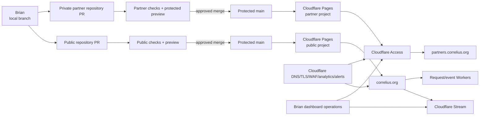

# Correlius.org MVP — Deployment Design

## Deployment goals

- An approved production commit produces an atomic, reversible static deployment.
- Public and partner artifacts cannot cross deployment boundaries.
- A failed build cannot replace the last successful version.
- Brian can publish routine content, release an episode, and approve/revoke a partner with short runbooks.
- Security-sensitive configuration remains in Cloudflare/GitHub, never content or client output.

## Environments

| Environment | Trigger | Host/access | Purpose | Data rules |
|---|---|---|---|---|
| Local | Explicit owner command | `localhost` | Authoring and fast tests | Placeholder/public content only; no production secret required |
| Public preview | Public-site pull request | Cloudflare Pages preview URL, access-restricted to Brian | Review content/layout/player configuration | `noindex`; use public or placeholder assets |
| Partner preview | Partner-site pull request | Access-protected preview URL | Review protected pages/downloads | Same protection/classification as partner production |
| Public production | Merge to public `main` | `https://correlius.org` | Anonymous canonical public site | Approved public material only |
| Partner production | Merge to partner `main` | `https://partners.correlius.org` behind Access | Approved evidence room | Partner-confidential material only |

There is no mutable staging database. Preview deployments are immutable build snapshots. Both production projects retain the last successful deployment and prior deployment identifiers for rollback.

## Repository and Git strategy

Use two repositories:

- `correlius-public-site`: may be public only after a repository-content review; contains no partner/sensitive material.
- `correlius-partner-site`: private; contains protected portal source and approved partner downloads.

Both use trunk-based development with short-lived branches and `main` as the sole production branch. Branch protection requires pull requests, passing checks, resolved review checklist, no force pushes/deletion, and no direct pushes. GitHub only offers enforced protected branches for private repositories on Pro or higher; the solo-owner design therefore budgets approximately $4/month for GitHub Pro. Brian may be sole maintainer, so the process requires documented self-review rather than inventing an unavailable second reviewer. High-risk account/policy changes receive an out-of-band checklist and, where practical, a trusted second-person review.

Cloudflare Pages' GitHub App is installed only on the corresponding repository. Automatic production builds listen only to `main`; pull requests receive previews. Partner preview and production URLs are Access-protected before real files are uploaded.

## Build process

The selected static generator is Astro in static-output mode. A clean, pinned runtime/package-manager install performs:

1. dependency integrity/advisory and secret checks;
2. strict content-schema validation;
3. forbidden-content and public/partner boundary scans;
4. static build to a disposable output directory;
5. HTML/heading/link/image/metadata/sitemap/security-header configuration tests;
6. unit/integration tests for release-state and form/event contracts;
7. accessibility automation on representative routes;
8. output-manifest review, including absence of source maps/secrets/private paths;
9. provider atomic publication only if every required step succeeds.

The public build fails if a released episode lacks captions/Stream UID/metadata or if protected path/content signatures appear. The partner build fails if an unmanifested download is present or a manifest file is missing. Production does not run on untrusted fork secrets.

## Deployment architecture

## Configuration and secrets

### Version-controlled, non-secret

- canonical domains and route constants;
- public Stream UIDs for released episodes;
- content schemas and build configuration;
- expected security headers/CSP source list;
- public Fractured Atlas URL and monitored public contact aliases;
- non-secret IDs/configuration explicitly safe for browsers.

### Provider-managed, sensitive

- Turnstile secret and KV HMAC pepper in Worker secret bindings;
- Email/Analytics/KV service bindings;
- any least-privilege deployment token in GitHub environment secrets (prefer native Pages integration without a token);
- Access allowlist/policies and authentication logs;
- Cloudflare account/API credentials and registrar/email recovery data.

Production and preview bindings are distinct where data could otherwise mix. Secret values are never printed, passed to preview builds from forks, or exposed through client environment prefixes.

## DNS and custom domains

- Cloudflare is authoritative DNS for `correlius.org`; DNSSEC is enabled and validated.
- Apex `correlius.org` is canonical. `www` either redirects permanently to apex or is deliberately supported; do not serve duplicate canonicals.
- `partners.correlius.org` maps only to the partner Pages project and is an Access self-hosted application.
- Protect or redirect the partner project's production `pages.dev` hostname; protect wildcard preview deployments and aliases.
- Remove stale CNAMEs and custom domains before launch. Verify TLS, HTTP-to-HTTPS redirects, HSTS readiness, CAA policy if used, and no dangling hostname.
- Registrar has 2FA, transfer lock, auto-renew, current payment/recovery contacts, and renewal alerts.

## Stream configuration

Stream assets are uploaded through Brian's 2FA-protected dashboard. Per released asset, record UID, processing state, duration, allowed origins, caption readiness, poster/thumbnail, and release verification in the episode release checklist. Public films do not require signed tokens; allowed origins include only intentional production/preview hosts. Stream API credentials are unnecessary in the MVP deployment pipeline.

## Access configuration

- One self-hosted application/policy boundary covers the partner custom host.
- Pages production and preview hostnames receive Access policies as documented by Cloudflare Pages.
- Exact-email Allow entries only; OTP identity provider; 8-hour session; deny by default.
- Application name/help text avoids email enumeration and links to the public request process.
- Brian approves/revokes through Cloudflare configuration, never code or the form Worker.
- Access configuration is recorded in a secret-free checklist/export description; policy data containing partner email remains restricted.

## Deployment pipeline and failure behavior

Cloudflare Pages Git integration is recommended for the fewest credentials. A production merge triggers a clean provider build. Cloudflare publishes only after successful completion and retains the prior production deployment; a build error never replaces it. Required GitHub checks should run before merge, while provider build logs provide a second record.

A preview is not production approval. Brian checks relevant phone/desktop routes, privacy/content boundaries, Stream behavior, social metadata, and direct partner URLs before merge. Production smoke checks run after deployment. If a smoke check detects a serious error, use the rollback runbook.

## Monitoring and alerts

- Cloudflare Pages deployment notifications: failures and production completion.
- Cloudflare security notifications available on the Free plan.
- Cloudflare Incident Alert filtered to relevant Pages/Stream components where the account UI supports the filter. This identifies provider-declared incidents; it is not an on-demand Stream per-asset monitor.
- An hourly scheduled GitHub Actions smoke check requests the public homepage and a stable playback resource, uses only included private-repository CI minutes, and notifies Brian on workflow failure. This is the free replacement for Cloudflare Pro Health Checks.
- Billing/usage alerts for Stream; quota review for free Workers, KV, Analytics Engine, and verified-destination Email Service usage.
- Domain registration/renewal and certificate/DNSSEC reminders.
- Access authentication log review after approvals/suspected misuse and within the Free plan's 24-hour window.
- Manual monthly smoke check for Home, one episode, public form, partner Access challenge, protected download, and Fractured Atlas link.

No third-party APM/error tracker is added. The existing mandated GitHub platform performs the scheduled check. Analytics outage does not fail the site. Because US-22 explicitly names Cloudflare built-in alerting, the GitHub check requires a requirement amendment; Cloudflare Pro Health Checks are a cost no-go.

## Cost controls

- Cloudflare Pages, Functions/Workers, KV, Turnstile, Analytics Engine, Web Analytics, WAF/Bot controls, and Access stay on Free tiers.
- Access is capped below 50 active partner users. No paid seat or log-retention plan is enabled.
- GitHub Pro (approximately $4/month) is the fixed near-free cost required for protected branches on the private partner repository.
- Stream is usage-based: $5 buys 1,000 stored minutes and delivery is $1 per 1,000 minutes. Disable autoplay/preload, enable billing alerts, and review usage monthly.
- Domain renewal is the other unavoidable recurring cost.
- No automatic upgrade, overage purchase, Pro Health Check, Workers Paid email, Enterprise logging/bot feature, or paid monitoring service is authorized.

## Rollback and recovery model

- **Bad static deploy:** promote/roll back to the known-good Pages deployment, verify, then revert/fix source through a PR.
- **Bad Stream metadata but safe asset:** correct content and deploy; prior public version remains available until merge.
- **Bad/corrupt Stream asset:** mark episode unavailable/unpublished first, then repair/re-upload and update UID through a reviewed release.
- **Security/legal removal:** do not roll back to a deployment that republishes removed content. Disable the Stream asset and create a new clean deployment or safe known-good version confirmed not to contain it.
- **Account compromise:** revoke sessions/tokens/integrations, secure account/recovery channels, freeze deploys, assess Git history/builds, rotate secrets, and redeploy known-good source.
- **Repository loss:** recover from GitHub and an owner-maintained clone/backup; Pages is deployment output, not source backup.
- **Master loss:** recover from private source-master backup; Git/Stream derivatives are not the archival master.

## Deployment runbook

1. Open a short-lived branch in the correct repository; never place partner content in the public repository.
2. Make only the intended content/configuration change and run local checks.
3. Push and open a pull request; read the diff for secrets, identifiers, placeholders, external URLs, and cross-boundary files.
4. Confirm CI passes and inspect the correct preview. Partner previews must challenge before content.
5. Complete the self-review checklist: content accuracy, accessibility, privacy/rights, security implications, and rollback target.
6. Merge to protected `main`; do not bypass checks.
7. Watch the Pages build. On failure, stop; last successful production remains live.
8. Run production smoke checks and record deployment ID/time. If critical checks fail, execute rollback.

## Rollback runbook

1. Classify the problem: ordinary content/layout, security/privacy exposure, or legal/IP removal.
2. If security/privacy/legal, first contain the exposed asset/service (Access policy, Stream asset, Worker secret) and do not choose an older deployment until its contents are verified safe.
3. In Pages, promote/restore the most recent known-good safe deployment for the affected project.
4. Verify canonical host, key routes, headers, partner direct URLs, and playback as relevant.
5. Revert/correct source on a branch and merge through normal checks so `main` again matches production.
6. Record cause, deployment IDs, exposure window, actions, and any credential/data notification decision. Seek appropriate legal/security advice when required.

## New episode release runbook

1. Confirm private master backup/checksum and approved credits/captions.
2. Upload to Stream; wait for processing; configure allowed origins/poster; upload and test English captions.
3. Add one draft episode record and optimized public images; never add the master.
4. Validate content and preview the detail/card on supported devices; test player controls, captions, fallback, metadata, and existing episodes.
5. Change to `released`, add release date/UID, and merge through the protected public pipeline.
6. Verify Watch order, episode canonical/share preview, sitemap, Stream playback/origins, analytics, and billing dashboard.
7. Record release/deployment IDs and retain the prior safe deployment.

## Partner approval runbook

1. Review the request notification manually; verify context through a trusted reply/channel as warranted. Form submission alone is not approval.
2. In Cloudflare Zero Trust, add the exact normalized email to the partner Access Allow policy. Do not create a broad domain rule.
3. Use policy testing/configuration review to confirm the address matches and unrelated test address does not.
4. Notify the applicant through the approved mailbox with the partner URL and OTP expectations; do not send a password.
5. Confirm successful authentication in Access logs after their first use. Record approval rationale/date in private operational notes if Brian chooses; never in public Git.

## Partner revocation runbook

1. Remove the exact email from the Access Allow policy.
2. Find the user in Access and revoke active tokens/sessions; removal alone is insufficient for urgent revocation.
3. Verify an incognito request to the portal and a direct protected download cannot retrieve content with a new session. Allow for documented provider propagation.
4. Record revocation date/reason privately and review whether shared downloaded materials or contact changes require follow-up.
5. Do not redeploy either website unless content itself must change.

## Routine content deployment

Public/partner copy, findings, calls-to-action, funding categories, and resource manifests use templates and schemas. The ordinary workflow is edit data/Markdown, preview, merge, verify. Authentication logic/policies are outside repository content. External links and dates receive scheduled review. Essential runbooks live in non-sensitive repository documentation; the US-21 legal response plan remains outside the public repository.

## Disaster/recovery considerations

- Maintain local or private backups of both repositories and restricted source records; test restoration at least annually.
- Keep source masters in at least two controlled locations; Stream is delivery, not archival backup.
- Export/record secret-free Cloudflare configuration values and screenshots/checklists sufficient to recreate Pages/DNS/Stream/Access without exposing emails/tokens.
- Maintain owner recovery codes and emergency contacts offline.
- Quarterly verify domain renewal, DNSSEC, 2FA/recovery, allowlist, Pages host inventory, Stream assets/captions, alerts, and billing.
- Recovery-time objective is pragmatic rather than contractual: public static rollback should take minutes once Brian is available; partner access remains fail-closed; unrecoverable provider/account events depend on provider support.

## Open questions

1. Confirm repository names/visibility and GitHub ownership model.
2. Confirm use of Cloudflare Free tiers and that GitHub Pro, domain renewal, and low-volume Stream usage are within the near-free ceiling.
3. Confirm canonical `www` behavior, monitored addresses, and domain/registrar status.
4. Confirm where backups, private response plan, raw research, and masters reside.
5. Confirm who besides Brian, if anyone, may perform emergency content removal.
6. Amend or reject US-22's Cloudflare-only availability-alert wording; the free design uses Cloudflare Incident Alerts plus an hourly GitHub Actions smoke check.
7. Accept the Free-plan 24-hour Access-log window or amend/reject US-24's retention wording.
