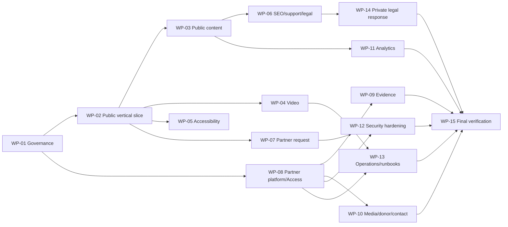

# Correlius.org MVP — Ordered Implementation Plan

## Plan principles

Work is divided into small packages that a coding agent can implement and verify one at a time after Brian approves this design. The order establishes a safe public vertical slice early, then adds content/video/accessibility/discovery, the request path, protected partner capability, measurement, hardening, operations, and final acceptance.

No package in this document is executed during the design phase.

## Delivery sequence

WP-03, WP-04, and WP-05 may proceed in parallel after WP-02. WP-07 and WP-08 may proceed in parallel after their dependencies. WP-09 and WP-10 may proceed in parallel once the protected portal is proven. WP-11 can begin after route/event names stabilize. WP-12 is cross-cutting and can audit earlier work incrementally but must finish after the form and Access configuration exist. WP-15 is sequential and last.

## WP-01 — Source, governance, and build foundation

**ID.** WP-01  
**TITLE.** Establish secure repositories and deterministic static builds  
**OBJECTIVE.** Create separate public/private source boundaries, branch protections, and minimal Astro static-build foundations.

**REQUIREMENTS SATISFIED.** US-16, US-18, US-24, US-26; Success 10 and 13.

**DEPENDENCIES.** Brian approval of two repositories, GitHub ownership, Astro, production branch name, and approximately $4/month GitHub Pro as a near-free requirement for private-repository branch protection.

**FILES/AREAS EXPECTED TO CHANGE.** New public repository; new private partner repository; package/lock/runtime configuration; CI checks; contribution/self-review checklist; ignore/secret-scan configuration.

**IMPLEMENTATION TASKS.** Create both repositories; select pinned supported runtime/package manager; scaffold static-only builds; install only essential dependencies; establish content/test directories; configure clean CI; protect `main`; restrict Cloudflare GitHub App scope; enable Dependabot/equivalent and secret scanning; document self-review; add forbidden-file/output checks.

**SECURITY CONSIDERATIONS.** Partner repository must be private before content arrives. No production secret in local/sample files. Workflows have least permissions and immutable action pins. Do not migrate raw research or legal files “temporarily.”

**TEST/VERIFICATION.** Clean clone/build; lockfile integrity; direct push/force-push rejection; failing check blocks merge; secret fixture is detected; public output scan cannot see partner markers.

**DEFINITION OF DONE.** Two controlled repositories build deterministic placeholder sites, protected branches/checks are evidenced, dependency/security automation is active, and no deployed content exists yet.

## WP-02 — Safe public vertical slice and Pages deployment

**ID.** WP-02  
**TITLE.** Put a minimal, safe public Correlius.org shell online  
**OBJECTIVE.** Deploy Home, Watch placeholder, About placeholder, Support placeholder, For Partners placeholder, footer, 404, and responsive navigation as static Pages output.

**REQUIREMENTS SATISFIED.** Foundation for US-01, US-04, US-07, US-08, US-16, US-17, US-22.

**DEPENDENCIES.** WP-01; Cloudflare account/zone/domain access.

**FILES/AREAS EXPECTED TO CHANGE.** Public layouts/components/pages/styles; Pages project; DNS/custom-domain/redirect configuration; basic headers/robots.

**IMPLEMENTATION TASKS.** Implement semantic shared layout, skip link, exact public navigation, mobile menu, footer disclaimer placeholder clearly marked for approval, routes and 404; configure public Pages Git integration, preview access, canonical apex/`www` behavior, HTTP→HTTPS; add performance budgets and production smoke tests.

**SECURITY CONSIDERATIONS.** No partner routes/assets. Use text/system fonts and no third-party scripts. Start CSP in report-only/preview with a narrow baseline. Preview is noindex and restricted to Brian.

**TEST/VERIFICATION.** Route/status/link checks; keyboard/mobile/320px/200%-zoom checks; induced build failure leaves prior production; cache/HTTPS/canonical checks; baseline Lighthouse/WebPageTest-equivalent measurement.

**DEFINITION OF DONE.** A fast public shell is live through Cloudflare Pages, safely reversible, contains no private data, and exposes all required navigation without claiming unfinished features are available.

## WP-03 — Public project and episode content system

**ID.** WP-03  
**TITLE.** Implement validated public content and page structures  
**OBJECTIVE.** Build Home, Watch, episode-detail generation, About, and reusable content collections without final Stream release dependency.

**REQUIREMENTS SATISFIED.** US-01–US-03, US-05, US-14, US-16, part of US-17.

**DEPENDENCIES.** WP-02; approved project/creator/episode facts and public images.

**FILES/AREAS EXPECTED TO CHANGE.** Public content schemas/records, page templates, EpisodeCard/PageIntro/CTA/image components, asset pipeline, content QA tests.

**IMPLEMENTATION TASKS.** Implement schemas from document 05; render project/mission/history/creator content; generate ordered Watch and episode routes; enforce release states/four-episode fixture; build placeholder-image fallback; validate claims/credits/alt text; prohibit placeholder production releases.

**SECURITY CONSIDERATIONS.** Treat Markdown as untrusted author input unless sanitized/controlled. Validate external CTA hosts. Scan assets/metadata for private identifiers and EXIF/document metadata.

**TEST/VERIFICATION.** Schema negative tests; 4+ episode fixture; add Episode N+1 without navigation/template edits; coming-soon has no player; mobile content review; claim/private-file scan.

**DEFINITION OF DONE.** Approved public content renders through reusable structures; four or more episodes fit without redesign; invalid or incomplete releases fail the build.

## WP-04 — Cloudflare Stream playback and release workflow

**ID.** WP-04  
**TITLE.** Deliver anonymous, captioned on-demand films  
**OBJECTIVE.** Integrate the two completed episodes with accessible Stream playback and prove the Episode N+1 workflow.

**REQUIREMENTS SATISFIED.** US-04–US-06, US-14, US-19, US-22; Success 1, 2, and 8.

**DEPENDENCIES.** WP-02; preferably WP-03; actual masters, captions, metadata, image/credit approvals; Cloudflare Stream account.

**FILES/AREAS EXPECTED TO CHANGE.** Episode records; StreamPlayer/fallback; release validation/tests; Stream dashboard configuration; release checklist.

**IMPLEMENTATION TASKS.** Upload masters; confirm backups; configure allowed origins; attach reviewed English captions; implement responsive iframe/player and readable failure state; populate two released records; document dashboard billing check; rehearse an N+1 draft/preview/release without touching navigation/authentication.

**SECURITY CONSIDERATIONS.** No master in Git; no Stream API token in client/CI; UID is public; allowed origins are anti-embedding, not DRM; credits/rights reviewed.

**TEST/VERIFICATION.** Anonymous controls/playback/caption tests in current Safari/Chrome/Firefox/Edge and iPhone/Android/tablet/desktop; off-domain embed rejection; network/player failure; existing episode regression; Stream analytics visibility.

**DEFINITION OF DONE.** Both completed episodes play publicly without account/payment/email, captions and controls work, failure is readable, origins are restricted, and Brian has rehearsed the documented release path.

## WP-05 — Accessibility acceptance baseline

**ID.** WP-05  
**TITLE.** Meet the WCAG AA-oriented experience requirements  
**OBJECTIVE.** Complete cross-template accessibility implementation and manual verification, including playback and forms as they arrive.

**REQUIREMENTS SATISFIED.** US-06, accessibility portions of US-01, US-04, US-08, US-10, US-22; Success 9.

**DEPENDENCIES.** WP-02; coordinate with WP-03, WP-04, WP-07, WP-09, and WP-10 as each surface lands.

**FILES/AREAS EXPECTED TO CHANGE.** Semantic components/styles; automated a11y tests; test matrix; caption/chart/download remediation.

**IMPLEMENTATION TASKS.** Correct landmarks/headings/labels/alt; visible focus; keyboard menu/form/player integration; contrast and forced-colors; responsive/zoom/reduced-motion behavior; accessible validation/status; chart summaries/tables; document accessibility checks.

**SECURITY CONSIDERATIONS.** Accessibility status messages must not reveal allowlist/security state. Do not weaken CSP with accessibility widgets; prefer native semantics.

**TEST/VERIFICATION.** axe/HTML automation plus manual keyboard, VoiceOver/NVDA-equivalent, 200% zoom, 320px reflow, contrast/forced-colors, captions, error recovery, target-size/device checks.

**DEFINITION OF DONE.** No critical/serious automated issue remains, every US-06 criterion has manual evidence, released captions are approved, and known limitations are documented and triaged.

## WP-06 — Discovery, support, disclaimer, and public trust

**ID.** WP-06  
**TITLE.** Complete SEO/social metadata, Fractured Atlas routing, and legal posture  
**OBJECTIVE.** Make public pages accurately discoverable/shareable and legally honest without adding marketing or payment scope.

**REQUIREMENTS SATISFIED.** US-03, US-07, US-17, US-20, US-23; Success 7 and 11.

**DEPENDENCIES.** WP-03; approved metadata/images/disclaimer/credits and Fractured Atlas URL.

**FILES/AREAS EXPECTED TO CHANGE.** SeoHead, public page metadata, sitemap/robots, Support, footer/credits, link/metadata tests, security headers.

**IMPLEMENTATION TASKS.** Add unique titles/descriptions/canonicals/OG/Twitter fields; episode-specific share assets; public-only sitemap; robots; Support disclosure/external CTA; approved all-page disclaimer and required credits; link validator; final CSP sources for social/static behavior.

**SECURITY CONSIDERATIONS.** No partner URL/resource in sitemap. Validate external URL host. Do not publish legal memo or overstate fair use. Social image/text must not leak private evidence.

**TEST/VERIFICATION.** Metadata crawler; sitemap/robots diff; Slack/Discord/X/Facebook previews; Fractured Atlas reachability/transition; footer crawl; public/partner legal-summary consistency review.

**DEFINITION OF DONE.** Every public page has accurate metadata, both sites have correct discovery posture, donations remain fully external, and approved disclaimer/credits are globally reachable.

## WP-07 — Public partner-access request

**ID.** WP-07  
**TITLE.** Build the minimum secure, manually reviewed request path  
**OBJECTIVE.** Collect only required fields, suppress/flag recent duplicates, notify Brian, confirm applicants, and never grant Access.

**REQUIREMENTS SATISFIED.** US-08, US-18, US-19, US-25, US-28; Success 3.

**DEPENDENCIES.** WP-02; Brian's verified Email Service destination, monitored address, privacy/retention text, acceptance of on-page applicant confirmation, and KV residual risk. No Workers Paid plan is authorized.

**FILES/AREAS EXPECTED TO CHANGE.** For Partners form/result pages; Worker; Turnstile/KV/Email/Analytics bindings; privacy page; endpoint/security tests; DNS email records.

**IMPLEMENTATION TASKS.** Implement strict request contract; progressive HTML response; server-side Turnstile; WAF/Worker rate limit; HMAC normalized-email KV marker/24h TTL; safe notification to Brian's verified address; server-rendered applicant receipt after accepted delivery; aggregate outcomes; log redaction; SPF/DKIM/DMARC sending setup; manual-review copy. Do not bind Access administration credentials.

**SECURITY CONSIDERATIONS.** Input/header injection, request/body limits, origin/CSRF, enumeration-neutral responses, no body logs/Git storage, secret bindings, mailbox retention/access. Fail honestly on provider error.

**TEST/VERIFICATION.** Valid/invalid/malicious/oversized/replayed Turnstile; rate-limit; same-email duplicate within/after 24h; Brian email delivery and applicant on-page receipt; no Access change; log/analytics payload inspection; email authentication headers and accessibility.

**DEFINITION OF DONE.** Production form meets every US-08 field/process condition, resists basic abuse, has disclosed data handling, emails Brian, confirms the applicant on-page, stays within Free tiers, and cannot grant partner access.

## WP-08 — Partner Pages and Cloudflare Access boundary

**ID.** WP-08  
**TITLE.** Establish the deny-by-default evidence-room platform  
**OBJECTIVE.** Deploy a protected portal shell and prove that no HTML/file/alternate hostname is anonymously retrievable.

**REQUIREMENTS SATISFIED.** US-09, US-15, US-18, US-24, US-25; Success 4 and part of 8/10.

**DEPENDENCIES.** WP-01; Cloudflare Zero Trust Free configuration; Brian approval of an 8-hour session, fewer than 50 active partners, the 24-hour log window, and amendment/provider proof for the PIN-rate-limit criterion.

**FILES/AREAS EXPECTED TO CHANGE.** Private partner site shell/routes/styles/robots/headers; partner Pages project; Access application/policy; approval/revocation test fixtures/runbooks.

**IMPLEMENTATION TASKS.** Build exact partner navigation and placeholder pages; configure custom domain; protect custom host, production `pages.dev`, wildcard previews and aliases; exact-email Allow + OTP + 8h session; generic denial/help; logout; noindex/noarchive; authentication log access.

**SECURITY CONSIDERATIONS.** Access must precede origin. No broad domain/everyone rules. Add/remove/revoke only in dashboard. Do not claim zone WAF controls hosted OTP. The exact per-email PIN-rate criterion is no-go until amended or proven; no paid identity replacement is authorized.

**TEST/VERIFICATION.** Approved/unapproved/email-enumeration behavior; expired/invalid PIN; session expiry/logout; remove and active revoke; unauthenticated GET/HEAD for HTML/PDF/ZIP/image/missing path on every hostname; public films unaffected.

**DEFINITION OF DONE.** A placeholder portal is usable by one approved test address and fails closed everywhere else; Brian can approve/revoke without code; the active-user cap and 24-hour logs are accepted; US-09/US-25 are amended or supported by provider evidence.

## WP-09 — Audience evidence and feature case

**ID.** WP-09  
**TITLE.** Publish reviewed, de-identified partner evidence  
**OBJECTIVE.** Implement Partner Overview, Audience Evidence, and Feature Correlius from approved aggregates/materials.

**REQUIREMENTS SATISFIED.** US-10, US-11, US-18; Success 5.

**DEPENDENCIES.** WP-08; approved de-identified aggregates/quotes/report and editorial content.

**FILES/AREAS EXPECTED TO CHANGE.** Partner content schemas/records/pages; accessible charts/tables; protected report manifest/file; evidence review checklist.

**IMPLEMENTATION TASKS.** Encode `n=11`, methodology, relationship subgroups, counts/derived percentages, encouraging/critical results, limitations, anonymous quote evidence IDs; render accessible summaries/charts; add protected accessible PDF; build editorial topics/formats and contact path.

**SECURITY CONSIDERATIONS.** Raw CSV/identity map never enters repo/build. Strip metadata and identifiers. Claims must not imply representative demand, behavioral/clinical impact, or silent creator independence.

**TEST/VERIFICATION.** Count/percentage/schema checks; human source trace and de-identification review; PDF a11y/privacy scan; direct download Access denial; decision-maker comprehension review.

**DEFINITION OF DONE.** Approved partners can assess methodology, balanced evidence, limitations, and feature case without any direct identifier; public/unauthenticated users receive no bytes.

## WP-10 — Donor brief, media kit, and contact

**ID.** WP-10  
**TITLE.** Deliver partner-ready funding and collaboration resources  
**OBJECTIVE.** Provide the required feature kit, donor information, downloads/package, usage guidance, and direct contact.

**REQUIREMENTS SATISFIED.** US-12, US-13, US-18, US-19; Success 6 and 7.

**DEPENDENCIES.** WP-08; approved assets/rights/credits, funding facts, contact address, Fractured Atlas URL.

**FILES/AREAS EXPECTED TO CHANGE.** Donor Brief, Media Kit, Contact; resource/funding schemas; protected files/package/manifest; aggregate contact event.

**IMPLEMENTATION TASKS.** Separate completed/planned milestones; add approved funding categories and sponsor/rights language; assemble all required individual resources and one essential package; add descriptive filenames, sizes, formats, usage/credit guidance; implement Contact Brian mail action and aggregate selection event.

**SECURITY CONSIDERATIONS.** Exclude copyrighted music, unlicensed promotional assets, production/private documents, identifiers, and rights-control promises. Contact event contains no identity/message.

**TEST/VERIFICATION.** Manifest/file parity; malware/type/metadata/rights/a11y checks; individual/package downloads after Access and denial before; Fractured Atlas/contact behavior; donor copy review.

**DEFINITION OF DONE.** A host can prepare a proposal from protected approved assets, and a donor can understand accomplishments/needs/sponsor/actions without rights misrepresentation.

## WP-11 — Privacy-conscious analytics

**ID.** WP-11  
**TITLE.** Implement the MVP metric dictionary and separate measurements  
**OBJECTIVE.** Measure the required public/partner actions without advertising trackers, identity payloads, or survey-data joins.

**REQUIREMENTS SATISFIED.** US-19, US-22.

**DEPENDENCIES.** Stable routes from WP-03/WP-08 and actions from WP-04/WP-07/WP-10.

**FILES/AREAS EXPECTED TO CHANGE.** Edge traffic analytics filters; player/action instrumentation; event Worker/Analytics Engine dataset; metric dictionary/dashboard notes; privacy content.

**IMPLEMENTATION TASKS.** Keep client-side Web Analytics and Network Error Logging disabled; separate edge request metrics by public and partner hostname; verify Stream dashboard/API definitions; instrument enumerated film-start/support/request/contact events only where native products do not; validate allowed event schema; document visits/plays/minutes/inquiries/invitations/donations distinctions; exclude identities/query strings/free text; set retention/access; verify usage stays within Analytics Engine's Free limits and add no paid fallback.

**SECURITY CONSIDERATIONS.** Partner auth logs are restricted and not joined to event/page data. Event endpoint rate-limited and noncritical. No applicant/partner/participant ID or fingerprinting.

**TEST/VERIFICATION.** Fire each event once and inspect stored dimensions; reject arbitrary event/free text; verify both surfaces separate; analytics outage does not block action; reconcile sample Stream minutes/views without overclaiming.

**DEFINITION OF DONE.** Brian can locate every required metric or its explicitly approximate proxy, understands its definition/limitation, and no event contains identity or survey data.

## WP-12 — Security, domain, and email hardening

**ID.** WP-12  
**TITLE.** Complete the concrete launch security baseline  
**OBJECTIVE.** Apply and verify transport, headers, WAF/bot/rate, account, supply-chain, domain, email, secret, logging, and disclosure controls.

**REQUIREMENTS SATISFIED.** US-18, US-23–US-28; Success 10 and 13.

**DEPENDENCIES.** WP-01, WP-07, WP-08; production domains; Cloudflare Free-tier inventory; GitHub Pro near-free approval.

**FILES/AREAS EXPECTED TO CHANGE.** Pages/Worker header and security config; GitHub settings/workflows; Cloudflare WAF/rules/DNS/alerts; registrar/email configuration; `security.txt`; security evidence checklist.

**IMPLEMENTATION TASKS.** Enforce HTTPS/HSTS safely; deploy tested CSP/nosniff/frame/referrer/permissions headers; inventory third-party scripts/SRI; enable Free-plan WAF/bot/rate controls; verify 2FA/GitHub Pro branch rules/scopes/secrets/dependencies/fail-closed; DNSSEC/registrar lock/renewal; SPF/DKIM/DMARC; publish/monitor `security.txt`; confirm 24-hour Access logs/revocation and direct assets; require amendment/provider proof for the OTP limitation; audit the cost guardrail.

**SECURITY CONSIDERATIONS.** This package is the security gate. Do not mark controls complete from configuration intent—capture test evidence. HSTS/DMARC enforcement is phased to avoid self-inflicted outage/mail rejection.

**TEST/VERIFICATION.** Execute document 06 launch checklist; header/SSL/DNS/email validators; malicious form cases; Git/secret/dependency tests; alternate-host/direct-file probes; token/session revocation; security report delivery/triage exercise.

**DEFINITION OF DONE.** Every implementable US-23–US-28 control has current evidence, no critical gap remains hidden, no unapproved paid plan is active, and US-09/US-24/US-25 have the required amendments or owner/provider evidence.

## WP-13 — Deployment, monitoring, and owner operations

**ID.** WP-13  
**TITLE.** Make routine operation reversible and sustainable  
**OBJECTIVE.** Finalize deployment controls, alerts, rollback/release/access procedures, backup, and recovery documentation for one owner.

**REQUIREMENTS SATISFIED.** US-14–US-16, US-22, US-24, US-26; Success 8.

**DEPENDENCIES.** WP-02, WP-04, WP-08, WP-12 substantially complete.

**FILES/AREAS EXPECTED TO CHANGE.** Non-sensitive operations docs/checklists; Pages/alert/billing settings; backup/configuration inventory; runbook evidence.

**IMPLEMENTATION TASKS.** Implement document 07 runbooks; configure free build/deploy/incident/security alerts, hourly GitHub smoke check, and Stream billing alerts; record deployment IDs; establish backups and quarterly/monthly reminders; document configuration recreation without secrets; rehearse routine content deploy, failed build, rollback, N+1 episode, partner approval and revocation.

**SECURITY CONSIDERATIONS.** Runbooks must distinguish ordinary rollback from security/legal removal so old deployments do not restore forbidden content. Restricted configuration/email lists stay out of public docs.

**TEST/VERIFICATION.** Tabletop plus live non-destructive rehearsals; induced build failure; safe rollback; add/remove test partner; backup restore sample; Cloudflare and GitHub alert delivery; monthly cost/quota report.

**DEFINITION OF DONE.** Brian can perform each routine/high-priority operation from concise instructions without editing authentication code or hiring a developer, and US-22 has been amended to the free monitoring design or remains a launch no-go.

## WP-14 — Private legal/IP response process

**ID.** WP-14  
**TITLE.** Create and review the private inquiry/takedown response plan  
**OBJECTIVE.** Satisfy US-21 as a private operational deliverable without adding site functionality or legal advice.

**REQUIREMENTS SATISFIED.** US-03, US-17, US-18, US-21; Success 12.

**DEPENDENCIES.** Approved legal advisor/contact, removal authority, private storage, final public/partner legal summaries.

**FILES/AREAS EXPECTED TO CHANGE.** Private document system only; optional public repository checklist may record completion without sensitive content.

**IMPLEMENTATION TASKS.** Brian/legal advisor drafts who to contact first, what not to say publicly before advice, who can disable site/episode, and Cloudflare Stream/GitHub/Pages removal steps; store privately; compare public and partner statements; run a tabletop; record owner acknowledgment.

**SECURITY CONSIDERATIONS.** No privileged analysis, private correspondence, contacts, or plan text in public/partner builds or this public repository. Access to private plan is limited and backed up.

**TEST/VERIFICATION.** Brian confirms the document exists outside public Git, required topics/authority are explicit, statements align, and a simulated inquiry reaches the right first actions.

**DEFINITION OF DONE.** Brian has reviewed and can locate/use the private plan; no UI/code was added and no privileged content was deployed.

## WP-15 — Final MVP acceptance and launch

**ID.** WP-15  
**TITLE.** Verify every requirement and authorize launch  
**OBJECTIVE.** Execute end-to-end, security, accessibility, content, privacy, reliability, and owner-operation acceptance against the traceability matrix.

**REQUIREMENTS SATISFIED.** All implementable portions of US-01–US-28 and all 13 Definition of MVP Success criteria; US-09/US-22/US-25 and potentially US-24 must be amended or resolved before this package can pass.

**DEPENDENCIES.** WP-01–WP-14 complete; all open owner/content/provider decisions resolved or accepted in writing.

**FILES/AREAS EXPECTED TO CHANGE.** Test evidence/results; issue fixes through appropriate earlier packages; launch checklist/status in traceability/operations documentation.

**IMPLEMENTATION TASKS.** Re-read the MVP; verify every story/criterion/exclusion; run cross-browser/device/accessibility and social preview tests; test public anonymity and partner denial/direct files; exercise form/email/duplicate/rates; inspect repositories/builds/logs for sensitive data; validate analytics vocabulary; test rollback/alerts/runbooks; obtain Brian approvals; launch and recheck production.

**SECURITY CONSIDERATIONS.** No waiver is implicit. Any critical access, secret, privacy, TLS/header, account, cost, or content-rights failure blocks launch. A no-go criterion must be amended or supported by new provider evidence; merely accepting an unmet requirement is insufficient.

**TEST/VERIFICATION.** Use the final checklist below and attach dated evidence/links/screenshots in a restricted operational record as appropriate.

**DEFINITION OF DONE.** All 13 success criteria pass, every retained user-story criterion is implemented and verified, all no-go language has been formally amended or resolved with provider evidence, every out-of-scope item remains absent, the cost audit shows only approved free/near-free services, and Brian authorizes production launch.

## Parallelization and sequencing notes

- **Can parallelize:** public copy/schema (WP-03), Stream setup (WP-04), and accessibility component work (WP-05); request Worker (WP-07) and partner platform (WP-08); evidence (WP-09) and media/donor resources (WP-10); private legal plan (WP-14) once contacts/authority are known.
- **Must remain sequential:** repository/security foundation before production code; Access coverage before uploading real partner files; de-identification review before partner evidence deployment; email/domain setup before production form acceptance; core routes/actions before final analytics names; security hardening after all endpoints/hosts exist; final verification last.
- **Cross-cutting:** accessibility and security are acceptance streams, not end-only polish. WP-05/WP-12 add final gates but feed fixes back into the package that owns each component.

## Final MVP launch checklist mapped to success criteria

- [ ] **Success 1:** A first-time mobile tester explains Correlius and starts a film within two minutes.
- [ ] **Success 2:** Both completed episodes play in incognito mode without account/email/payment; controls and captions work.
- [ ] **Success 3:** A real test partner request collects only required fields, confirms the applicant, notifies Brian, and grants nothing.
- [ ] **Success 4:** Approved email receives/uses OTP; unapproved email receives no access; direct protected URL remains denied. OTP rate-limit disposition is recorded.
- [ ] **Success 5:** Evidence states `n=11`, method/subgroups/limitations, balanced count-backed findings and traceable anonymous quotes, with no identifiers.
- [ ] **Success 6:** A host downloads every required asset individually or in the labeled package; usage/rights/accessibility checks pass.
- [ ] **Success 7:** Donor reviewer understands completed/planned work, categories, fiscal sponsorship, Fractured Atlas action, and direct-conversation option.
- [ ] **Success 8:** Brian independently rehearses Episode N+1, routine content deploy, partner approval, active revocation, and rollback.
- [ ] **Success 9:** Automated and manual WCAG AA-oriented checks pass on likely phones and current desktop browsers, including 200% zoom.
- [ ] **Success 10:** Git/history/build/output/URL/log checks find no secret, raw participant data, identifier, allowlist, or sensitive legal/insurance/donor material.
- [ ] **Success 11:** Home, Watch, About, and episode links produce accurate title/description/image previews in common surfaces; public sitemap only.
- [ ] **Success 12:** Brian has reviewed/tabletopped the private legal/IP response plan stored outside public Git.
- [ ] **Success 13:** HTTPS redirect/HSTS/headers/SSL scan, GitHub/Cloudflare 2FA, scoped integrations, and branch protection have dated evidence.

## Architecture approval gate

Implementation should not start until Brian decides:

1. two repositories/projects and private partner repository;
2. Astro static generation;
3. on-page applicant confirmation and free Email Service notification only to Brian's verified destination;
4. KV 24-hour digest deduplication and its rare concurrent race;
5. 8-hour Access session, fewer than 50 active users, and acceptance/amendment of the 24-hour Free-plan log window;
6. amendment of US-09/US-25 to provider-managed Access OTP abuse controls versus further Cloudflare confirmation;
7. amendment of US-22 to free Cloudflare Incident/Pages alerts plus an hourly GitHub Actions smoke check;
8. approximately $4/month GitHub Pro, domain renewal, and low-volume Stream usage as the complete near-free cost envelope;
9. a numeric monthly/annual ceiling and Stream usage alert threshold;
10. monitored contacts, private record storage/retention, emergency removal authority, and required production content/URLs.
